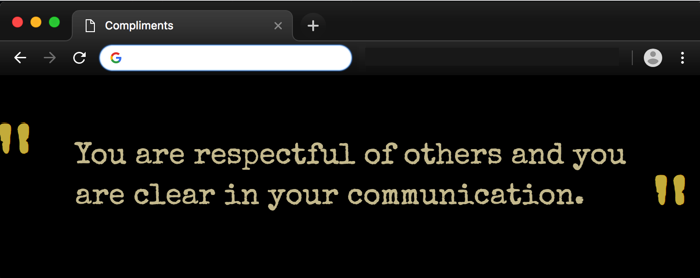
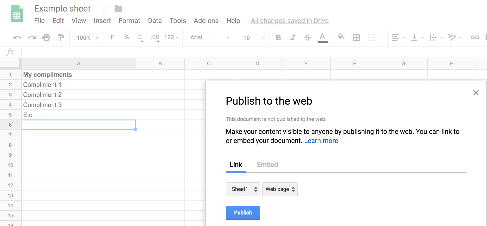
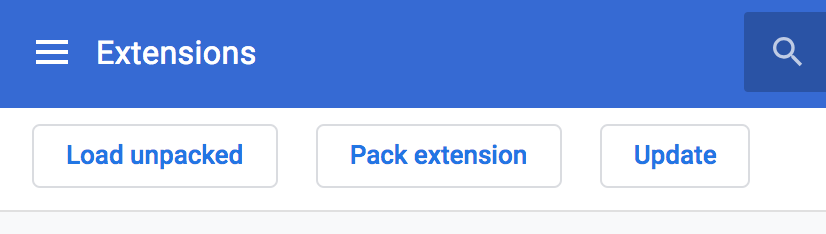

# compliments-on-new-tab

A chrome extension that shows you compliments from your own Google Sheet every time you open a new tab



# Background

When you get positive feedback, it's often nice for a moment and then you forget about it. Wouldn't it be cool if you would be reminded of these nice words every now and then? I think it would, so I put a lot of the positive feedback I have received over the years in a Google Sheet and created this Chrome extension to show me a random one every time I open a new tab.

# Setup

First, create a new Google Sheet and fill the rows of column A with positive feedback. You can give the header a name (cell A1) to keep it nice and readable.

When you're done, click on `File` > `Publish to the web...` . Select `Sheet1` and `Web Page` and click on the blue Publish button.



Then, have a look at the URL you see in your navigation bar and grab the ID of your Google Sheet from the position marked below:
`https://docs.google.com/spreadsheets/d/<HERE-IS-YOUR-ID>/edit#gid=0`

Now you have the ID, you can add it to the Chrome Extension that you're making. Open `chrome_extension/compliment_getter.js` and paste the Google Sheet ID between the double quotes on line 1:

```
var sheet_id = "HERE-GOES-YOUR-SHEET-ID";
```

Your extension is now finished, you just have to let your browser know about it. Open Chrome and navigate to: `chrome://extensions` in your navigation bar. In the top right, toggle the `Developer mode`.

Next, click on `Load unpacked`


In the window that opens, navigate to the folder `chrome_extension` and select it.

That's it. You can now enjoy a random compliment every time you open a new tab in Chrome!
